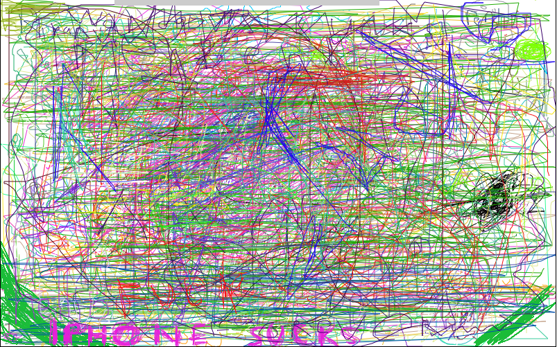

@

Mojolicious и Web 3.5
=====================

*Вячеслав Тихановский*

@

Mojolicious
===========

`perl -MSharifulin -e "say 'Mojolicious' x ∞"`;

@

и
=

 * десятая буква алфавита
 * союз, частица

@

Web 3.5? WTF?!
=============

@

Web 3.5 = CSS3 + HTML5
======================

@

WEBSOCKETS
=============

* `+` Canvas
* `+` Уголочки
* `+` Красивые обои

@

WebSockets &ndash; это просто!
-----------------------------------------------------------

ВебСокеты &ndash; двусторонние дуплексные каналы передачи данных через один TCP сокет

@

JavaScript vs Mojolicious
==========================

    var ws = new WebSocket(url);        websocket '/' => sub {
                                            my $self = shift;

    ws.onmessage = function(e) {            $self->receive_message(sub {
        var message = e.data;                  my ($self, $message) = @_;
    };                                      });

    ws.send('Hello');                       $self->send_message('Hello');
                                        };
@

Мал код, да могуч
=================

@

Showmethedrawing
================

http://github.com/vti/showmethedrawing

@

Искусство или чо?

@

Mojomber
========

http://github.com/vti/mojomber

@

Showmetheshell
==============

http://github.com/vti/showmetheshell

@

Showmethedesktop
================

http://github.com/vti/showmethedesktop

@

WebSockets &ndash; это просто!
-----------------------------------------------------------

Спасибо

Вячеслав Тихановский

http://github.com/vti
